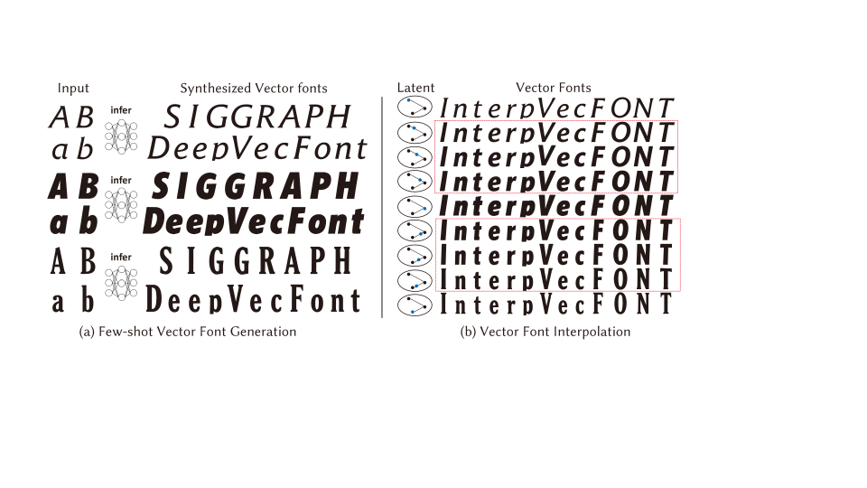

# DeepVecFont

This is the official Pytorch implementation of the paper:

Yizhi Wang and Zhouhui Lian. DeepVecFont: Synthesizing High-quality Vector Fonts via Dual-modality Learning. SIGGRAPH Asia. 2021.

Paper: [arxiv](https://arxiv.org/abs/2110.06688)
Supplementary: [Link](https://yizhiwang96.github.io/deepvecfont_homepage/pdfs/deepvecfont_sm.pdf)
Homepage: [DeepVecFont](https://yizhiwang96.github.io/deepvecfont_homepage/)

<div align=center>
	 
</div>

## Updates
### 2022-07-03
- DeepVecFont can now read data from single files when training, which significantly reduces memory consuming.
- DeepVecFont now better supports training images with resolution of 128 * 128, which should give better results. (the default image size now is 128 * 128, switch back to 64 by setting `image_size` in `options.py` to `64`.)
- [To Do] adding Chinese vector font support (will be available soon)
## Demo
### Few-shot generation
Given a few vector glyphs of a font as reference, our model generates the full **vector** font:

Input glyphs:
<div align=center>
	 
	 
	 
	 
</div>
Synthesized glyphs by DeepVecFont:
<div align=center>
	 
	 
	 
	 
	
	
	
	 
	 
	 
	 
	
	
	
	 
	 
	 
	 
	
	
	
	 
	 
	 	
	
	
	<br/>
	 
	 
	 
	 
	
	
	
	 
	 
	 
	 
	
	
	
	 
	 
	 
	 
	
	
	
	 
	 
	
	
		
	<br/>
</div>

Input glyphs:
<div align=center>
	 
	 
	 
	 
</div>
Synthesized glyphs by DeepVecFont:
<div align=center>
	 
	 
	 
	 
	
	
	
	 
	 
	 
	 
	
	
	
	 
	 
	 
	 
	
	
	
	 
	 
	 	
	
	
	<br/>
	 
	 
	 
	 
	
	
	
	 
	 
	 
	 
	
	
	
	 
	 
	 
	 
	
	
	
	 
	 
	
	
		
	<br/>
</div>

Input glyphs:
<div align=center>
	 
	 
	 
	 
</div>
Synthesized glyphs by DeepVecFont:
<div align=center>
	 
	 
	 
	 
	
	
	
	 
	 
	 
	 
	
	
	
	 
	 
	 
	 
	
	
	
	 
	 
	 	
	
	
	<br/>
	 
	 
	 
	 
	
	
	
	 
	 
	 
	 
	
	
	
	 
	 
	 
	 
	
	
	
	 
	 
	
	
		
	<br/>
</div>

### Vector font interpolation
Rendered:
<div align=center>
	 
	 
	 
	
	
	
	 
	
	
	
	 
	
	<br/>
	 
	 
	 
	
	
	
	 
	 
	
	
	 
	
	<br/>
	 
	 
	 
	
	
	
	 
	 
	
	
	 
	
	<br/>
	 
	 
	 
	
	
	
	 
	
	
	
	 
	
	<br/>
	 
	 
	 
	
	
	
	 
	
	
	
	 
	
	<br/>
</div>
Outlines:
<div align=center>
	 
	 
	 
	
	
	
	 
	
	
	
	 
	
	<br/>
	 
	 
	 
	
	
	
	 
	 
	
	
	 
		
	<br/>
	 
	 
	 
	
	
	
	 
	 
	
	
	 
		
	<br/>
	 
	 
	 
	
	
	
	 
	
	
	
	 
	
	<br/>
	 
	 
	 
	
	
	
	 
	 
	
	
	 
	
	<br/>
</div>

### Random generation (New fonts)
Rendered:
<div align=center>
	 
	 
	 
	 
	
	
	
	 
	 
	 
	 
	
	
	
	 
	 
	 
	 
	
	
	
	 
	 
	 	
	
	
	<br/>
	 
	 
	 
	 
	
	
	
	 
	 
	 
	 
	
	
	
	 
	 
	 
	 
	
	
	
	 
	 
	
	
		
	<br/>
</div>

## Installation

### Requirement

- **python 3.9**
- **Pytorch 1.9** (it may work on some lower versions, but not tested; the contextual loss can't work in Pytorch 1.10)

Please use [Anaconda](https://docs.anaconda.com/anaconda/install/linux/) to build the environment:
```shell
conda create -n dvf python=3.9
source activate dvf
```
Install pytorch via the [instructions](https://pytorch.org/get-started/locally/).
- Others
```shell
conda install tensorboardX scikit-image
```

### Install diffvg

We utilize diffvg to refine our generated vector glyphs in the testing phase.
Please go to https://github.com/BachiLi/diffvg see how to install it.

**Important (updated 2021.10.19):** You need first replace the original `diffvg/pydiffvg/save_svg.py` with [this](./data_utils/save_svg.py) and then install.

## Data and Pretrained-model

### Dataset
#### **The Vector Font dataset**
(This dataset is a subset from [SVG-VAE](https://github.com/magenta/magenta/tree/main/magenta/models/svg_vae), ICCV 2019.)
There are two modes to access the dataset:
- **pkl files:** (Download links: [Google Drive](https://drive.google.com/drive/folders/1dGOOXK63-QJKXnE7_fD2OCfYJGKsApSg?usp=sharing))
Using pkl files (that combine all fonts) consumes a lot of memory, but you don't need to generate a large number of single files.
Please download the `vecfont_dataset_pkls` dir and put it under `./data/`.
If you use this mode, set `read_mode` = `pkl`, in `options.py`. If you use the uploaded data, set `image_size` to `64`.
- **dirs:**
Generate directories for each data entry, which consumes much less memory.
You need to first download the ttf/otf files from [Google Drive](https://drive.google.com/file/d/1D-KxfDqpz1tOSY5VxfsU7o0HlKd0GuJI/view?usp=sharing) and extract it to `data_utils`.
Then follow the instructions in `Customize your own dataset` to process these ttf files. The dataset will be saved with the name of `vecfont_dataset_dirs`.
If you use this mode, set `read_mode` = `dirs`, in `options.py`.

#### **The Image Super-resolution dataset** 

This dataset is too huge so I suggest to create it by yourself (see the details below about creating your own dataset).

### Pretrained models
#### **The Neural Rasterizer** 
Download link: [image size 64x64](https://drive.google.com/drive/folders/10Qy7vFn27H2qQfve1Tu7UR3sm3l45cKg?usp=sharing), [image size 128x128](https://drive.google.com/drive/folders/1cKobKq74yDv9UGCoZ1WjHgjBN7sF3puS?usp=sharing). Please download the `dvf_neural_raster` dir and put it under `./experiments/`.

#### **The Image Super-resolution model**
Download link: [image size 64x64 -> 256x256](https://drive.google.com/drive/folders/1D_U4KHbt42u6ZGNNOAOvy5QXjwHj_abX?usp=sharing), [image size 128x128 -> 256x256](https://drive.google.com/drive/folders/157WTmx3o95K2c9KR-1Bznfl0J0EPqKOv?usp=sharing). Please download the `image_sr` dir and put it under `./experiments/`.

#### **The Main model** 
Download link: [image size 64x64](https://drive.google.com/drive/folders/1Ykacqk8VPhvVv_XFH47BBvGt8ZlBrpnZ?usp=sharing), [image size 128x128](https://drive.google.com/drive/folders/120B0oTXjsIgo8a-pyg1ZL_ZyC2eE3xNq?usp=sharing). Please download the `dvf_main_model` dir and put it under `./experiments/`.

Note that recently we switched from Tensorflow to Pytorch, we may update the models that have better performances.

## Training and Testing

To train our main model, run
```
python main.py --mode train --experiment_name dvf --model_name main_model
```
The configurations can be found in `options.py`.

To test our main model, run
```
python test_sf.py --mode test --experiment_name dvf --model_name main_model --test_epoch 1200 --batch_size 1 --mix_temperature 0.0001 --gauss_temperature 0.01
```
This will output the synthesized fonts without refinements. Note that `batch_size` must be set to 1. The results will be written in `./experiments/dvf_main_model/results/`.


To refinement the vector glyphs, run
```
python refinement_mp.py --experiment_name dvf --fontid 14 --candidate_nums 20 --num_processes 4
```
where the `fontid` denotes the index of testing font. The results will be written in `./experiments/dvf_main_model/results/0014/svgs_refined/`. Set `num_processes` according to your GPU's computation capacity. Setting `init_svgbbox_align2img` to `True` could give better results when the initial svg and raster image don't align well.

We have pretrained the neural rasterizer and image super-resolution model.
If you want to train them yourself:

To train the neural rasterizer:
```
python train_nr.py --mode train --experiment_name dvf --model_name neural_raster
```
To train the image super-resolution model:
```
python train_sr.py --mode train --name image_sr
```

## Customize your own dataset

- **Prepare ttf/otf files**

Put the ttf/otf files in `./data_utils/font_ttfs/train` and `./data_utils/font_ttfs/test`, and organize them as `0000.ttf`, `0001.ttf`, `0002.ttf`...
The ttf/otf files in our dataset can be found in [Google Drive](https://drive.google.com/file/d/1D-KxfDqpz1tOSY5VxfsU7o0HlKd0GuJI/view?usp=sharing).

- **Deactivate the conda environment and install Fontforge**

for python > 3.0:
```
conda deactivate
apt install python3-fontforge
```
It works in Ubuntu 20.04.1, other lower versions may fail in `import fontforge`.
- **Get SFD files via Fontforge**
```
cd data_utils
python convert_ttf_to_sfd_mp.py --split train
python convert_ttf_to_sfd_mp.py --split test
```

- **Generate glyph images**
```
python write_glyph_imgs.py --split train
python write_glyph_imgs.py --split test
```

- **package them to dirs or pkl**

dirs (recommended):
```
python write_data_to_dirs.py --split train
python write_data_to_dirs.py --split test
```

pkl
```
python write_data_to_pkl.py --split train
python write_data_to_pkl.py --split test
```
Note:

(1) If you use the mean and stddev files calculated from your own data, you need to retrain the neural rasterizer. For English fonts, just use the mean and stddev files we provided.

## Acknowledgment

- [SVG-VAE](https://github.com/magenta/magenta/tree/main/magenta/models/svg_vae)
- [SVG-VAE-pytorch](https://github.com/hologerry/svg_vae_pytorch) by [hologerry](https://github.com/hologerry)
- [Diffvg](https://github.com/BachiLi/diffvg)

## Citation

If you use this code or find our work is helpful, please consider citing our work:
```
@article{wang2021deepvecfont,
 author = {Wang, Yizhi and Lian, Zhouhui},
 title = {DeepVecFont: Synthesizing High-quality Vector Fonts via Dual-modality Learning},
 journal = {ACM Transactions on Graphics},
 numpages = {15},
 volume={40},
 number={6},
 month = December,
 year = {2021},
 doi={10.1145/3478513.3480488}
}
```
