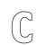
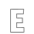
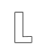
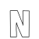
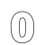

# DeepVecFont

This is the official Pytorch implementation of the paper:

Yizhi Wang and Zhouhui Lian. DeepVecFont: Synthesizing High-quality Vector Fonts via Dual-modality Learning. SIGGRAPH 2021 Asia. 2021.

<div align=center>
	 
</div>

## Demo
### Few-shot generation
Given a few vector glyphs of a font as reference, our model generates the full vector font:
Input glyphs:

Synthesized glyphs:
<div align=center>
	 
	 
	 
	 
	
	
	
	 
	 
	 
	 
	
	
		
	<br/>
		
</div>

## Installation

### Requirement

- **python 3.9**
- **Pytorch 1.9.0** (it may work on some lower versions, but not tested)

Please use [Anaconda](https://docs.anaconda.com/anaconda/install/linux/) to build the environment:
```shell
conda create -n dvf python=3.9
source activate dvf
```
### Install diffvg

We utilize diffvg to refine our generated vector glyphs in the testing phase.
Please go to https://github.com/BachiLi/diffvg see how to install it.

## Data and Pretrained-model

will be released soon...

## Training and Testing

To train our main model, run
```
python main.py --mode train --experiment_name dvf --model_name main_model
```
The configurations can be found in `options.py`.

To test our main model, run
```
python test_sf.py --mode test --experiment_name dvf --model_name main_model --test_epoch 625 --batch_size 1
```
This will output the synthesized fonts without refinements. Note that `batch_size` must be set to 1.


To refinement the vector glyphs, run
```
python refinement.mp.py --experiment_name dvf --fontid 4
```
where the `fontid` denotes the index of testing font.

We have pretrained the neural rasterizer and image super-resolution model.
If you want to train them yourself:

To train the neural rasterizer:
```
python train_nr.py --mode train --experiment_name dvf --model_name neural_raster
```
To train the image super-resolution model:
```
python train_sr.py --mode train --experiment_name dvf --model_name image_sr
```